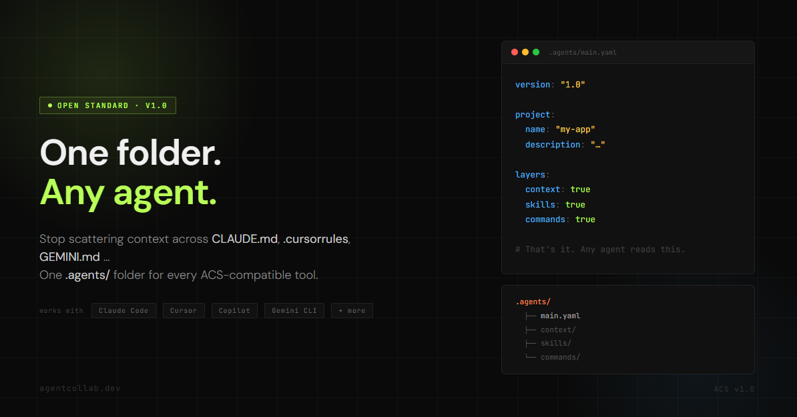

# ACS — Agentic Collaboration Standard



[](LICENSE)
[](spec/v1/)
[](https://www.npmjs.com/package/agentic-standard)
[](https://pypi.org/project/agentic-standard/)
[](https://marketplace.visualstudio.com/items?itemName=jackby03.acs-vscode)
[](CONTRIBUTING.md)

ACS defines how projects describe themselves to AI agents through a single `.agents/` folder that any ACS-compatible agent can read, regardless of which tool, IDE, or platform you use.

## The problem

Every agentic tool invents its own configuration format. Teams end up juggling different files and paths across tools such as Cursor, Zed, Claude Code, Gemini, Codex, Kiro, Trae, Windsurf, JetBrains Junie, Coodo, GitHub Copilot, Roo Code, Antigravity, Firebase Studio, and others.

In practice, that fragmentation shows up in vendor-specific files and folders:

| Tool | Config file / path |
|------|--------------------|
| Claude Code | `CLAUDE.md` + `.claude/` |
| Cursor | `.cursorrules` or `.cursor/rules/` |
| GitHub Copilot | `.github/copilot-instructions.md` |
| Codex (OpenAI) | `AGENTS.md` + `~/.codex/config.toml` |
| Windsurf | `.windsurfrules` |
| Gemini CLI | `GEMINI.md` |
| Zed | `.zed/` (editor settings with AI context) |
| Kiro | `.kiro/steering/` |
| JetBrains Junie | `.junie/guidelines.md` |
| Trae | `.trae/rules/` |
| Aider | `.aider.conf.yml` or `CONVENTIONS.md` |
| AGENTS.md-based tools | `AGENTS.md` |

Note: this table is a compatibility landscape snapshot for context, not a normative ACS contract. Tool-specific file names can change over time.

Teams working with multiple tools duplicate effort. Knowledge stays trapped in vendor-specific formats.

## The solution

One folder for ACS-compatible agents.

```
your-project/
└── .agents/
    ├── main.yaml          # Manifest: what this project uses
    ├── context/          # What agents need to KNOW
    ├── skills/           # What agents can DO
    ├── commands/         # Reusable single-shot tasks
    ├── agents/           # Named subagents for specific roles
    └── permissions/      # What agents are ALLOWED to do
```

## Install

```bash
# npm (Node.js)
npm install -g agentic-standard

# pip (Python)
pip install agentic-standard
```

Or install the [VS Code extension](https://marketplace.visualstudio.com/items?itemName=jackby03.acs-vscode) from the Marketplace.

## Quick start

```bash
# Scaffold a new .agents/ folder in your project
acs init

# Validate your existing .agents/ setup
acs validate

# List discovered layers
acs ls
```

The CLI generates a ready-to-use `.agents/` structure with a `main.yaml` manifest and a starter `context/project.md` — no manual YAML editing required.

## Documentation

- [Why ACS?](docs/why-acs.md)
- [Getting Started](docs/getting-started.md)
- [For non-developers](docs/for-non-devs.md)
- [For tool builders](docs/for-tool-builders.md)
- [Full specification →](spec/v1/)

## Compatibility

ACS is designed to coexist with existing standards:
- Works alongside `AGENTS.md`
- Compatible with `SKILL.md` (agentskills.io)
- Generates `CLAUDE.md` content on demand
- Complements MCP (different layer)

See [compatibility guides →](compatibility/)

## Status

ACS is at **v1.0.0-beta**. The spec, CLI, and VS Code extension are published and functional. We're gathering real-world feedback before cutting the official stable **v1.0.0** release.

| Component | Version | Registry |
|-----------|---------|----------|
| CLI (`agentic-standard`) | 1.0.3 | [npm](https://www.npmjs.com/package/agentic-standard) · [PyPI](https://pypi.org/project/agentic-standard/) |
| VS Code extension (`acs-vscode`) | 0.1.3 | [Marketplace](https://marketplace.visualstudio.com/items?itemName=jackby03.acs-vscode) |
| Spec | v1.0 | [spec/v1/](spec/v1/) |

[Roadmap](community/ROADMAP.md) · [Contributing](CONTRIBUTING.md) · [Adopters](community/ADOPTERS.md)
